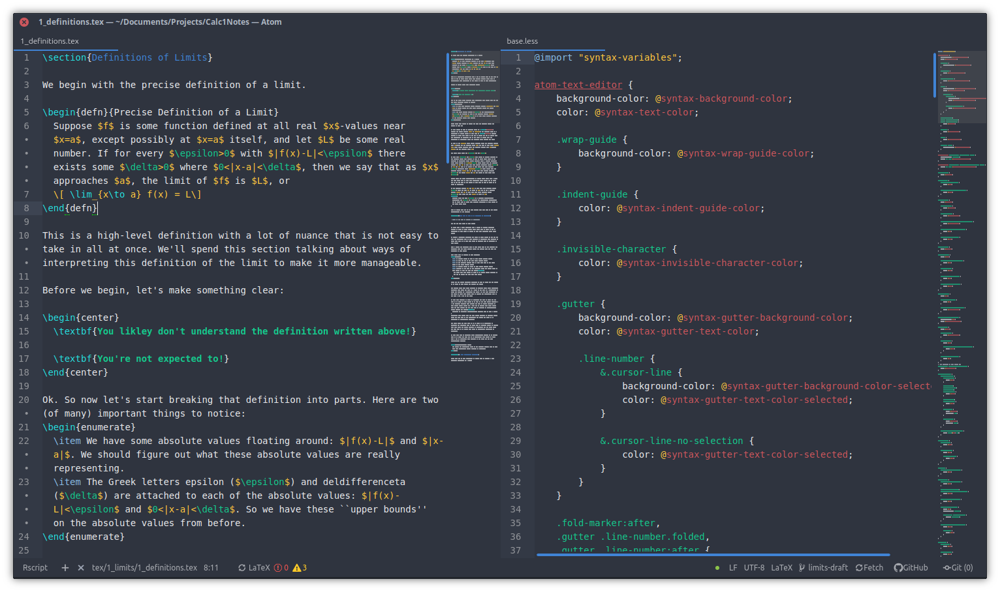

# arc-ish-syntax
An arc(ish) syntax theme for Atom.

It follows a similar color scheme as the popular Arc GTK theme, and works well with the [atom-minimal-ui](https://atom.io/themes/atom-minimal-ui) theme, pictured below.

## Installation

This syntax theme should be available to install in Atom under `Settings` -> `Install` -> `Themes` ->`arc-ish-syntax`

Or by terminal

`apm install arc-ish-syntax`
